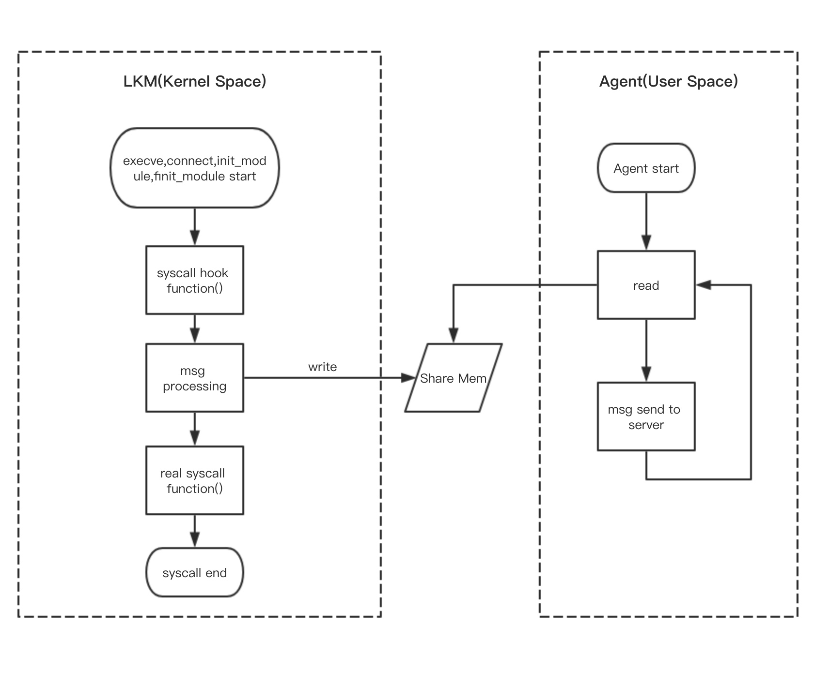
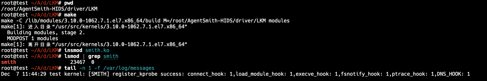
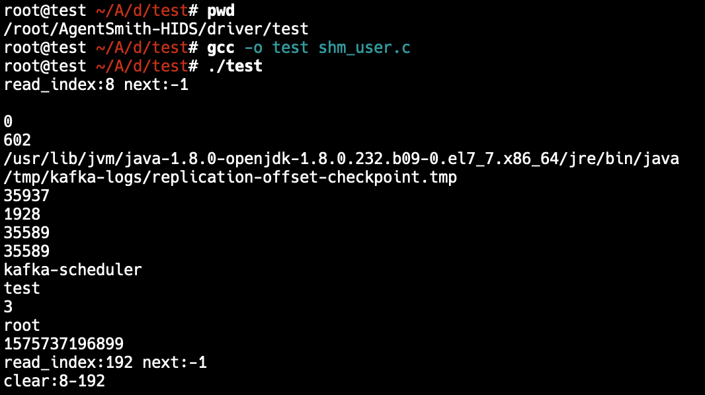
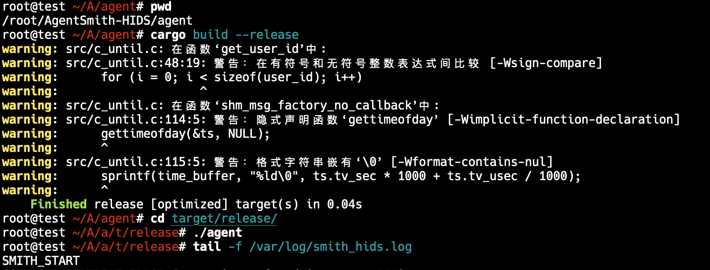

# AgentSmith-HIDS Quick Start

[English](AgentSmith-HIDS-Quick-Start.md) | 简体中文

### 1.AgentSmith-HIDS 简单流程图

### 2.Get Clone Project

`git clone https://github.com/EBWi11/AgentSmith-HIDS.git`

### 3.编译内核驱动模块

* `yum` 或者 `apt` 或者其他方式安装 `kernel-devel` && `kernel-header`
* 在`driver/LKM`目录执行`make`,得到'smith.ko'
* 执行`insmod smith.ko`
* 执行`lsmod | grep smitm`,验证smith驱动已安装成功
* 下发编译好的LKM文件到测试服务器，注意Kernel版本需要和编译服务器保持一致。

### 4.Test 'smith.ko'

* `yum` 或者 `apt` 或者其他方式安装 `gcc`
* 在:`driver/test`目录并且执行`gcc -o test shm_user.c`得到'test'测试文件
* 执行 `./test`,验证AgentSmith-HIDS的核心模块运行正常

### 5.部署Kafka环境 && 部署Agent Server环境(可选)

* 部署测试环境接收端Kafka Server，注意需要手动创建topic：
  创建topic：`./kafka-topics.sh --create --zookeeper localhost:2181 --replication-factor 1 --partitions 1 --topic hids`

* (可选)部署测试环境HIDS心跳Server，具体请看:[smith_console](https://github.com/EBWi11/AgentSmith-HIDS/tree/master/smith_console)

### 6.编译用户态模块

* 需要Rust-lang环境: https://www.rust-lang.org/tools/install

* 在目录：`agent/src/conf`下，先修改agent配置文件：`agent/src/conf/settings.rs`，修改相关的Kafka信息和心跳配置，通过`cargo build —-release`，在`agent/target/release/`下得到编译好的agent。(注：需要提前`install openssl` && `install openssl-devel`)

* 安装agent，下发agent到测试环境，直接执行即可

注：由于Agent取本机IP是通过命令:hostname -i，所以测试时请保证hostname和hosts配置正确，否则HIDS Console端无法读取正确的IP。）

### 7.自定义检测模块

1. 自定义检测模块依赖心跳检测模块，既需要开启心跳检测才可支持自定义检测模块；
2. 自定义检测模块的触发方式是心跳Server向Agent下发指令完成的，检测结果通过Kafka传递到Server端，因此不具备实时性；
3. 自定义检测函数添加在[detection_module.rs](https://github.com/EBWi11/AgentSmith-HIDS/blob/master/agent/src/lib/detection_module.rs) 文件下，并且需要在该文件的Detective impl的start函数定义好Mapping关系(Server下发指令和调用的检测函数关系)；
4. 添加完自定义检测函数后需要在[heartbeat_server.py](https://github.com/EBWi11/AgentSmith-HIDS/blob/master/smith_console/heartbeat_server.py) 中添加下发指令逻辑，注意需要和其他指令通过“;”间隔；
5. 实现逻辑，Agent向心跳服务器发送心跳包，Server返回检测指令，Agent通过指令和检测函数的Mapping执行指令所指的检测函数，检测结果通过Kafka传递到Server端。

### 8.卸载
* 卸载AgentSmith-HIDS前需要先关闭用户态agent进程，agent默认Log path：`/var/log/smith_hids.log`，默认pid file：`/var/run/smith_hids.pid`，默认下：`cat /var/run/smith_hids.pid |xargs kill -9`再通过`rmmod smith`来完成卸载。

### 9.Smith LKM Definition

| Define           | Description                                                  |
| ---------------- | ------------------------------------------------------------ |
| EXECVE_HOOK      | execve() Hook Switch: 1. Enable; Default:1         |
| CONNECT_HOOK     | connect() Hook Switch: 1. Enable; Default:1        |
| DNS_HOOK         | DNS Hook Switch: 1. Enable; Default:1              |
| PTRACE_HOOK      | Porcess Injection Detect Hook Switch: 1. Enable; Default:1 |
| MPROTECT_HOOK | Detect mprotect(PROT_READ or PROT_EXEC) in real time: 1.Enable; Default: 0 |
| CREATE_FILE_HOOK | Create File Detect Hook Switch: 1. Enable; Default:1 |
| LOAD_MODULE_HOOK | init_module() Hook Switch: 1. Enable; Default:1    |
| EXIT_PROTECT     | Protect the agent itself from being rmmod: 1.Enable; Default: 0 |
| ROOTKIT_CHECK    | Regularly detect rootkit behavior. The default is 15 seconds: 1.Enable; Default: 1 |
| UPDATE_CRED_HOOK | Detect abnormal process Cred changes in real time: 1.Enable; Default: 1 |

### 10.Simple Demo

